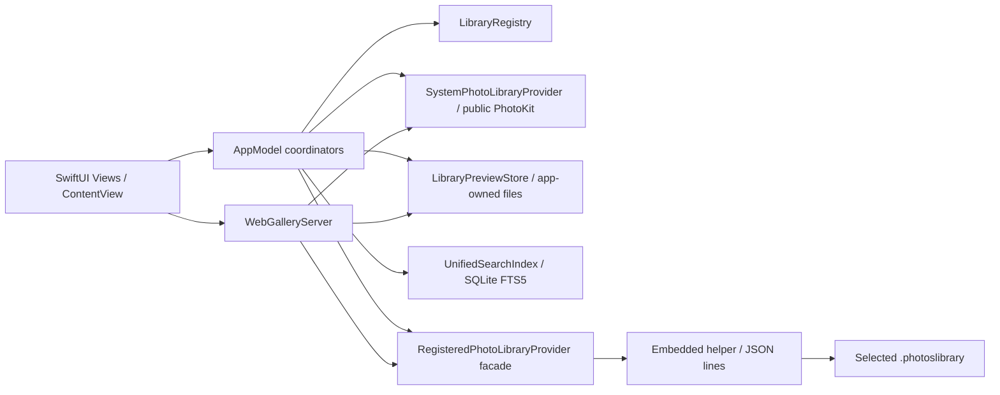

# Photo Libraries 技術文件

本文件描述目前工作樹中的 source 與 Xcode 設定，不代表成功 build、實機執行、外部服務可用或發佈核准。相對應的入門步驟見 [README](README.md)。

## 1. 狀態與系統概觀

| 狀態 | 本專案的證據與界線 |
| --- | --- |
| **Implemented** | `MyApp`、`ContentView` 接入系統／註冊圖庫、搜尋、地圖、Memories、轉移及 Web Gallery。這表示有正常 source 呼叫鏈，不代表 build 或 runtime 成功。 |
| **Test-covered** | 沒有找到測試 target 或相應測試檔；本次不能標示任何功能有測試覆蓋。 |
| **Verified in this task** | 僅核對 source、Xcode 設定、目錄及 Git diff；完成後的文件靜態檢查另記於文末。沒有執行 app build、test 或瀏覽器驗證。 |
| **Externally unverified** | 真實 Photos 圖庫、權限、iCloud 媒體、Tailscale Serve、MapKit 服務、遠端瀏覽器、簽署與發佈結果。 |
| **Experimental / inactive** | `PoC/` 未進入 targets；`RegisteredLibraryProbeModel` 的舊式 Photos Automation 目錄／預覽索引與 `PhotosAutomationClient` 的多數操作沒有從目前 app UI 接入。`Open in Photos` 仍是 UI 可達的 Photos 互動。 |
| **Planned / not implemented** | 沒有可執行的 iOS app target、完整離線 iPhone `.photoslibrary` 閱讀器或獨立雲端 backend。第 15 節是建議擴充方向。 |

正常執行入口為 `Photo Libraries/MyApp.swift` 的 `@main MyApp`。它持有 `LibraryRegistry`、`SystemPhotoLibraryViewModel` 與共用 `LibraryPreviewStore`，由 `ContentView` 建立 `RegisteredLibraryProbeModel`、`UnifiedSearchViewModel`、`PhotoTransferCoordinator` 和各視圖。系統圖庫走 public PhotoKit；非系統圖庫的目錄從使用者授權套件取得快照，媒體讀取及轉移經內嵌 `PhotoLibrariesDirectHelper`。Gallery 是 app 內的 loopback HTTP server，沒有獨立部署的 backend。

## 2. 架構、依賴與生命週期

`MyApp` 是主要 composition root；`ContentView` 將長生命週期的 registry、system model、store 傳給子視圖，並以 `@StateObject` 持有畫面層 coordinator。`LibraryPreviewStore.shared` 與 `WebGalleryServer.shared` 是 process 內 singleton。註冊圖庫的 helper 是另一個 process；`DirectLibraryWorkerClient` 序列化 JSON-lines request/response，避免回覆配錯請求，並管理 child process 的啟停。Gallery 的 `NWListener`、連線表與 system video 暫存由 `WebGalleryServer` 擁有，停止時取消 listener、連線及暫存。

`Photo Libraries/Domain/` 和 `PhotoKitModels.swift` 定義圖庫、資產與轉移資料邊界；view/model 層不應直接把某個圖庫的 `PHAsset.localIdentifier` 當作跨圖庫 ID。`LibraryID` 是 app 自有 UUID，搜尋與 Memories 的文件 ID 組合 `LibraryID` 與資產 ID。`DirectLibraryHelper/HelperModels.swift` 提供 helper 專用 wire shape，不連結主 app model。

## 3. Project Structure

| 實際路徑／型別 | 責任與關係 |
| --- | --- |
| `Photo Libraries/MyApp.swift`、`ContentView.swift` | app 入口、選單、sidebar、權限觸發、Gallery 啟動嘗試、選取狀態及 coordinator 注入。 |
| `Domain/LibraryModels.swift`、`Domain/PhotoTransferModels.swift`、`Domain/PhotoTechnicalMetadata.swift` | 圖庫 identity/availability、轉移模型、ImageIO／AVFoundation 技術 metadata。 |
| `LibraryRegistry/LibraryRegistry.swift` | 驗證使用者選取的 `.photoslibrary`、保存 security-scoped bookmarks、解析 read/write scope 與離線／失效狀態。 |
| `PhotoKit/SystemPhotoLibraryProvider.swift`、`AppModel/SystemPhotoLibraryViewModel.swift` | public PhotoKit 授權、系統 assets／相簿、縮圖與 viewer、變更觀察、資源匯出／匯入／刪除。 |
| `PhotoKit/RegisteredPhotoLibraryProvider.swift`、`PhotoKit/DirectLibraryWorker.swift`、`DirectLibraryHelper/` | 非系統圖庫 SQLite catalog 快照、helper process 私有 PhotoKit 存取、媒體預覽與轉移；非官方 API 風險集中於此。 |
| `AppModel/RegisteredLibraryProbeModel.swift`、`AppModel/LibraryPreviewStore.swift` | 直接目錄刷新、app-owned manifest／preview／playback cache；同檔保留未接入的舊 Automation 索引程式。 |
| `Search/SearchQueryParser.swift`、`Search/UnifiedSearchIndex.swift`、`Search/PlaceNameResolver.swift`、`AppModel/UnifiedSearchViewModel.swift` | 查詢解析、SQLite FTS5 持久化索引、MapKit 逆地理編碼與 UI task 排程。 |
| `Memories/`、`Views/` | metadata-only Memories 建議、音樂／slideshow；系統與註冊圖庫、跨圖庫網格、地圖、資訊及影片視圖。 |
| `WebGallery/WebGalleryServer.swift`、`WebGalleryHTTP.swift`、`WebGalleryPage.swift`、`WebGallerySettingsView.swift` | loopback listener、受限 HTTP API、內嵌 HTML/JS 與設定 UI。 |
| `PoC/`、`Tools/generate_memory_music.py` | 未接入 app 的探針；手動生成已附帶 WAV/CAF 音樂資產。 |

## 4. Core Components

`LibraryRegistry` 的輸入是使用者選取的 package URL，輸出是帶有 app identity、授權 bookmark 與 availability 的 descriptor；它負責 scope 的取得與釋放，不由畫面長期持有已開啟的 security scope。`SystemPhotoLibraryProvider` 的輸入是 PhotoKit 授權與 asset identifiers，輸出是資產摘要、相簿、影像／資源或明確錯誤；`SystemPhotoLibraryViewModel` 持有 UI 可觀察狀態及 PhotoKit change observer。

`RegisteredLibraryProbeModel` 的正常輸入是 registry descriptor，輸出是交給 `LibraryPreviewStore` 的 `DirectLibraryCatalog` 或 per-library error。store 擁有 manifest、app-owned files、memory cache 和 direct provider facade；facade 的 child process 以 JSON line 封裝讀取媒體及轉移操作。`UnifiedSearchViewModel` 消費 system assets 與 store mutations，擁有搜尋 task，將持久化查詢交給 `UnifiedSearchIndex` actor，將座標解析交給 `PlaceNameResolver` actor。`PhotoTransferCoordinator` 消費明確選取及目的圖庫，持有 progress、結果及待確認刪除狀態。`WebGalleryServer` 消費 registry、system model 與 store 的共享範圍快照，擁有 listener、HTTP connections 和影片暫存。

## 5. Data Flow

### 系統圖庫

使用者註冊系統圖庫後，`ContentView` 檢查 `PhotoLibraryAuthorization`，`SystemPhotoLibraryViewModel` 經 `SystemPhotoLibraryProvider` 取得 assets 與相簿階層；public PhotoKit observer 監看變更，延後刷新並使相關縮圖 cache 失效。網格、viewer、資訊面板按需請求 image／video／技術 metadata。隱藏資產不輸出給 Web Gallery 或 Memories。PhotoKit 權限與本機／iCloud 資源可用性會影響結果；各請求可分別限制是否允許網路。

### 非系統圖庫

`LibraryRegistry` 保存選取套件的 read bookmark；`RegisteredLibraryProbeModel.loadDirectCatalog` 在有效 scope 中讀取目錄，重新讀取通常有 60 秒間隔。`DirectLibraryCatalog.read` 先把套件內 `Photos.sqlite` 及 WAL 複製到暫存位置，再以 SQLite read-only 與 `PRAGMA query_only=ON` 查詢；它不是直接改寫來源資料庫。`LibraryPreviewStore.adoptDirectCatalog` 拒絕以空目錄覆蓋舊的非空目錄，也拒絕重複資產 ID，並保留可回收的 app-owned 預覽。影像、影片、Live Photo motion 與寫入操作由簽署的 helper 透過獲授權 bookmark 存取。資料庫 schema 與私有 PhotoKit 呼叫均依賴非公開行為。

### 搜尋、地圖與 Memories

`UnifiedSearchViewModel` 將系統 assets 和註冊圖庫 manifest 正規化為 `UnifiedSearchDocument`，再交 `UnifiedSearchIndex` 的 SQLite/FTS5。`SearchQueryParser` 支援 free text、favorite/favourite、width、height、dimension(s)、type/media、library、city、country、place/location、year、date 條件；日期解析使用目前時區。系統圖庫的搜尋文件 caption／keywords 目前為空，註冊圖庫則使用目錄文字 metadata；搜尋範圍不能一概視為相同。座標可由 `PlaceNameResolver` 透過 MapKit 逆地理編碼並快取地名，服務結果需外部驗證。

`LibraryMapView` 只從已載入資產或 manifest 的 GPS metadata 建立跨圖庫地圖，約 5 km 網格聚合及 MapKit marker cluster；沒有另一套地理資料來源。`MemoriesView` 排除無日期項目與系統隱藏資產，`MemoryGenerator` 在背景以 metadata 決定 On This Day、trip、event 建議；這不是 Apple Photos 的 Memories 資料。音樂使用 app 隨附資產，slideshow 對靜態照片定時換頁，影片期間暫停音樂。

### 複製與搬移

`PhotoTransferCoordinator` 負責 system → registered 與 registered → system。它驗證目的圖庫 write scope，將資源匯出到 app-owned `Transfer Staging`，匯入目的地，再以可取得的 catalog、文字 metadata、相簿資訊及 SHA-256／資源證據重新核對。只有符合 fidelity 條件者才顯示可刪除來源的待確認狀態；來源刪除另有破壞性 alert，再次核對後才經 helper 或 public PhotoKit 刪除。複合資源、編輯版本及缺失的 Live Photo 配對可能只能複製或保留來源。這不是原子交易：失敗、取消或確認中斷時，目的地副本可能已存在，使用者須檢查兩庫。

### Web Gallery

`WebGalleryServer` 在保存的 host、login、共享圖庫條件齊全時由 app 啟動 task 嘗試啟動，亦可在 Settings 手動控制。`NWListener` 綁定 `127.0.0.1:8766`；`WebGalleryHTTPConnection` 只接受一個 GET/HTTP/1.1 request、無 request body、最多 16 KiB headers、初始 request 30 秒 timeout。每個 API request 都經 Host、允許的 `tailscale-user-login`、Origin 和 `Sec-Fetch-Site` 檢查，再限制為共享圖庫及可見資產。路由包括 `/api/libraries`、`/api/items`、`/api/collections`、`/api/item`、`/api/image`、`/api/video`、`/api/map`、`/api/place`、`/api/memories`、`/api/memory-music`、`/api/map-token` 及首頁；沒有把 URL path 直接映射到檔案。`/api/items` 分頁上限 100；影片支援單一 byte range、206/416，分塊串流。系統影片準備有共用 in-flight task、四筆 cache 上限與停止時清理。

內嵌網頁使用分頁、lazy image queue、AbortController／generation 防止過期結果覆蓋新畫面，並用瀏覽器 `localStorage` 保存版面、選取、縮放與捲動狀態。地圖依賴可選的 MapKit JS token 與 Apple CDN。實際網頁播放、Tailscale header 可信度、HTTPS 終止及跨裝置體驗均未由 repository 證明。

## 6. Data Models and State：持久化與版本

| 邊界 | Source 中的儲存方式與失效行為 |
| --- | --- |
| 圖庫註冊 | `LibraryDescriptor` 含 `LibraryID`、kind、read bookmark、可選 write bookmark 與展示 metadata；`LibraryRegistry.descriptors.v1` 以 `UserDefaults` 保存。路徑 metadata 不授權存取，仍須重新解析 bookmark。 |
| 瀏覽狀態 | `ContentView`、`LibraryBrowserPositionStore` 使用 `UserDefaults`；browser 端 `localStorage` 有自己的 v1 狀態，還原時檢查目標是否仍存在。 |
| 註冊圖庫衍生資料 | `LibraryPreviewManifest`、縮圖、viewer preview、MP4 playback 等寫在 Application Support 的 `Photo Libraries/Preview Index`；舊 manifest 的可選欄位保持可解碼，舊 ID／檔案可恢復。來源圖庫不充當 app cache。 |
| 搜尋與地名 | Application Support 的 `Photo Libraries/Search Index/search.sqlite3` 使用 WAL、FTS5、`user_version=1`；版本不同則重建可衍生索引。`places.json` 保存逆地理編碼成功結果。 |
| 暫存 | 轉移資源寫入 app-owned staging；Web Gallery 影片代理使用暫存目錄。失敗／取消時不保證所有目的地副本或暫存都已復原。 |
| 網頁設定 | `expectedHost`、允許的 login、共享圖庫 ID、MapKit JS token 都在 `UserDefaults`。token 不是存於 Keychain，且 `/api/map-token` 會提供給已授權訪客瀏覽器。 |

## 7. Important Logic 與邊界

- **目錄與 ID**：`LibraryID` 區分來源圖庫；相同 local asset identifier 不在跨圖庫場景直接合併。註冊圖庫 catalog 去重；新空 catalog 不覆蓋舊非空畫面。直接目錄更新保留已有的 app-owned files，避免整庫重新匯出。
- **媒體與 metadata**：縮圖按需載入並使用記憶體／磁碟 cache；ImageIO 提取圖片 metadata，AVFoundation 提取可讀影片的技術 metadata。沒有可讀原始檔或資源時資訊可能缺失。System Media Types 取 PhotoKit subtype；註冊圖庫目前主要可辨識 video／Live Photo，不能宣稱全部類型一致。
- **搜尋**：索引更新以 `LibraryID` scope 對齊新舊文件；座標不變時保留已解析地名；FTS5 與結構化條件共同查詢。Place resolver 對相同座標合併 in-flight request，至少間隔 1.5 秒；暫時錯誤最多重試三次，退避至約 10 秒，限流錯誤依回傳 reset 延遲。
- **Memories**：On This Day 取同月日的往年照片，至少三張；event／trip 至少五張，依時間、位置與推測 home 分組，session 最長 14 天。結果是本地建議，可隨 index、時區、日期與地名資料變化。
- **Gallery 容量**：最多 32 個同時連線；前端縮圖併發上限 6、有限次重試。圖片與影片端點在異步工作後再次核對分享／授權狀態；album 不完整時 API 可回 409。這些只是 source 的容量與防舊任務設計，沒有負載測試證據。

## 8. External Dependencies

主要 Apple APIs／frameworks 包括 SwiftUI/AppKit、Photos/PhotosUI、ImageIO、AVFoundation/AVKit、MapKit/CoreLocation、Network、Combine、CryptoKit、SQLite3、UniformTypeIdentifiers 與 OSLog；隨 OS/SDK 提供，repository 沒有分別釘選版本。`RegisteredPhotoLibraryProvider` 除 public PhotoKit 功能外，另透過 Objective-C runtime 呼叫未公開 selectors；`DirectLibraryCatalog` 讀取未文件化的 Photos SQLite schema，均非穩定官方 extension API。Web Gallery 外部需要使用者配置 Tailscale Serve；可選的 MapKit JS 由 Apple CDN 載入，需自行提供 Maps token。音樂生成腳本另外依賴未固定版本的 NumPy 與系統 `afconvert`，不是 app runtime dependency。

## 9. Configuration

Xcode project 含 `Photo Libraries` app 與 `PhotoLibrariesDirectHelper` tool target；兩者 `SUPPORTED_PLATFORMS = macosx`、macOS deployment target 27.0、Swift language version 5.0，Debug／Release 組態。app target 依賴且內嵌 helper。專案記錄 `CreatedOnToolsVersion = 26.3`，未宣告最低 Xcode 版本，也沒有 repository 內 shared `.xcscheme`、測試 target、CI、package manifest 或 lockfile。

`Photo Libraries/Photo Libraries.entitlements` 設定 sandbox、Photos、Apple Events／Photos scripting、network client/server、bookmark 和 user-selected files 權限；helper 以 `com.apple.security.inherit` 繼承 sandbox。Info.plist usage descriptions 在 `project.pbxproj` build settings。沒有 repo-declared environment variable、`.env`、API secret 檔或 feature-flag 配置；Gallery 設定經 UI 與 `UserDefaults`。專案寫有特定 development team 與 Automatic signing，但本次沒有檢查帳戶、憑證或簽署成果。

## 10. Error Handling and Logging

`LibraryRegistryError` 區分非圖庫、離線、bookmarks stale、權限不足等狀態；`DirectLibraryError` 覆蓋 SQLite／私有 PhotoKit／媒體錯誤；搜尋資料庫開啟與 SQL 失敗會轉成 `UnifiedSearchIndexError`。視圖與 models 以 published status／error text 顯示載入、重新授權、索引及轉移失敗。Gallery 對不合法或未授權 request 回 400／403／404 等，媒體 range 不合法回 416；HTTP response 設 no-store、安全 headers 與 CSP。

`RegisteredLibraryProbeModel` 限制目錄刷新頻率並保留取消及舊 Automation 索引的預覽重試／bisect 程式，但後者不是目前正常自動路徑。PhotoKit image request、搜尋 task、Memories grouping 與 Gallery 影片準備有取消或 generation 保護；不保證已完成的外部匯入可回滾。Place resolver 對可重試錯誤退避，永久無結果則停止。`RegisteredLibraryProbeModel` 使用 OSLog 記錄預覽索引效能；本次沒有執行 logger、稽核實際日誌或驗證所有敏感欄位遮罩，不應宣稱完整 redaction。

## 11. Security and Privacy

系統圖庫經 public PhotoKit 授權；註冊套件需使用者選取和 security-scoped bookmark，讀取與轉移寫入 scope 分開。目錄 SQLite 從套件複製後唯讀查詢；app-owned 索引、預覽、搜索和暫存會在本機保存照片衍生資料，source 未提供資料庫加密或 cloud sync。轉移的來源刪除採獨立確認及重新核對，但不能保證操作原子性或完全保真。

Gallery 只在 loopback 提供 HTTP，外部 TLS 終止及可信 `tailscale-user-login` header 依賴另外設定的 Tailscale Serve；repository 沒有內建 TLS、憑證 pinning 或自行驗證 Tailscale 身分的程式。它逐 request 限制分享圖庫與可見資產，但授權訪客可以儲存或截圖內容。MapKit JS token 儲於 `UserDefaults` 並提供給授權瀏覽器；沒有 Keychain 保護。沒有 App Attest、APNs、推播或 WebView 橋接路徑的 source 證據。以上為 source 設計描述，非本次安全測試或外部部署驗證。

## 12. Testing

Repository 未找到 XCTest／Swift Testing target、測試檔、fixture validation、CI、lint／format／typecheck 設定或正式測試指令；因此 **Test-covered：無 repo 證據**。`PoC/` 的 Swift 探針與 `Tools/generate_memory_music.py` 是可另外執行的工具，不算 app 測試覆蓋。**Verified in this task** 只限 source／設定／文件靜態核對，沒有 macOS Build、unit/UI test、瀏覽器、實際圖庫或裝置驗證。使用者須在 Xcode 自行執行 Build／Test；沒有已驗證的命令列 scheme 可記錄。

## 13. Known Limitations and Technical Debt

主要技術債是非系統圖庫依賴私有 PhotoKit 與 Apple Photos 套件 schema，OS 升級、圖庫遷移、iCloud 資源及發佈審核都可能改變行為。Photos Automation 的舊索引程式仍在 source，增加維護耦合；目前 `ContentView.scheduleAutomaticSync` 只排程直接 catalog refresh，不能把舊 `attemptAutomaticSync` 說成正在執行。App-owned cache 與搜尋 index 可重建，但沒有真實大型圖庫容量／效能基準。轉移驗證是保守的 fail-closed 設計，遇到不確定 fidelity 時保留來源；代價是某些項目無法直接搬移，亦不能聲稱已成功搬移即完整保留編輯與所有資源。

## 14. Design Decisions

系統圖庫使用 public PhotoKit，非系統圖庫的私有 PhotoKit 呼叫隔離在 helper，避免在主 app process 啟用多圖庫模式而干擾系統圖庫呼叫。讀取套件目錄採暫存 SQLite snapshot 與唯讀查詢，衍生預覽／搜尋 index 留在 app 自己的儲存空間。這減少直接改動來源的風險，但依賴未公開 schema，且快照可能受來源同時變動影響。跨圖庫轉移以核對目的地與另外確認刪除來源為界線，犧牲一步完成的便利，保留不確定項目的來源。

## 15. Future Development（建議，未實作）

- 在 `RegisteredPhotoLibraryProvider`／`DirectLibraryCatalog` 邊界加入 OS 與圖庫格式相容性檢查及明確降級路徑，維持 read scope 與 write scope 分離；不要讓 view 直接依賴私有 selector。
- 以現有 `PhotoTransferCoordinator` 與 `PhotoResourceExportManifest` 為擴充點，增加真實媒體與中斷恢復測試，保留「目的地驗證完成後，來源刪除另行確認」的安全界線。
- 為 `UnifiedSearchIndex`、`SearchQueryParser`、`MemoryGenerator`、Gallery HTTP parser 加入離線測試；另用受控的實際圖庫、瀏覽器和 Tailscale 環境驗證 provider／分享路徑，不將 mock 或 fixture 結果提升為外部可用性聲明。
- 若另建 iPhone 上完整 `.photoslibrary` 離線閱讀器，需獨立 target、套件 parser、資源關聯與實機驗證；目前 macOS helper/private PhotoKit 路徑不能直接當成 iOS 實作。

## 本次文件驗證紀錄

**Verified in this task**：已比對 source 與 `project.pbxproj` 的 target、平台、deployment target、helper、資料儲存路徑及 Gallery 設定；檢查兩份 Markdown 的 code fence、相對連結、個人絕對路徑與常見 credential 形態；`git diff --check` 及兩個新檔的 `git diff --no-index --check` 無空白錯誤。Git 狀態中的既有程式碼修改與未追蹤檔仍在，這次只新增兩份文件。沒有執行 Xcode Build／Test、瀏覽器或外部服務驗證。
