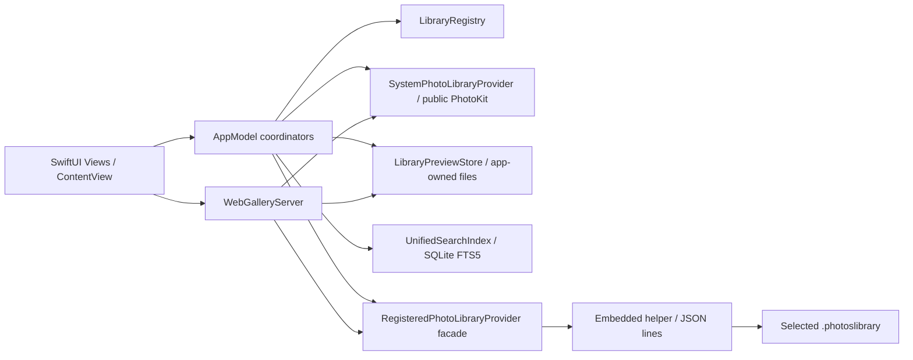

# Photo Libraries Technical Documentation

This document describes the source and Xcode configuration in the current working tree. It does not establish a successful build, operation on a physical device, external service availability, or release approval. See the [README](README.md) for getting started.

## 1. Status and System Overview

| Status | Project evidence and limits |
| --- | --- |
| **Implemented** | `MyApp` and `ContentView` connect the system and registered libraries, search, maps, Memories, transfers, and Web Gallery. This establishes a source-level call path, not a successful build or runtime result. |
| **Test-covered** | No test target or corresponding test files were found; no feature can be described as test-covered in this task. |
| **Verified in this task** | Only source, Xcode configuration, directories, and Git diff were checked; static document checks are recorded at the end. No app build, tests, or browser verification were run. |
| **Externally unverified** | Real Photos libraries, permissions, iCloud media, Tailscale Serve, MapKit services, remote browsers, signing, and release results. |
| **Experimental / inactive** | `PoC/` is not included in the targets. The legacy Photos Automation catalog/preview indexing code in `RegisteredLibraryProbeModel` and most `PhotosAutomationClient` operations are not connected to the current app UI. `Open in Photos` remains a UI-accessible Photos interaction. |
| **Planned / not implemented** | There is no runnable iOS app target, complete offline iPhone `.photoslibrary` reader, or independent cloud backend. Section 15 suggests possible extensions. |

The normal entry point is `@main MyApp` in `Photo Libraries/MyApp.swift`. It owns `LibraryRegistry`, `SystemPhotoLibraryViewModel`, and the shared `LibraryPreviewStore`. `ContentView` creates `RegisteredLibraryProbeModel`, `UnifiedSearchViewModel`, `PhotoTransferCoordinator`, and the views. The system library uses public PhotoKit. The catalog for a non-system library is snapshotted from a user-authorized package; media access and transfers go through the embedded `PhotoLibrariesDirectHelper`. The Gallery is an in-app loopback HTTP server, with no independently deployed backend.

## 2. Architecture, Dependencies, and Lifecycle

`MyApp` is the main composition root. `ContentView` passes the long-lived registry, system model, and store to child views and holds screen-level coordinators with `@StateObject`. `LibraryPreviewStore.shared` and `WebGalleryServer.shared` are process-local singletons. The registered-library helper runs in another process. `DirectLibraryWorkerClient` serializes JSON-lines requests and responses to avoid mismatched replies and manages the child process lifecycle. `WebGalleryServer` owns the Gallery's `NWListener`, connection table, and temporary system-video files; stopping it cancels the listener and connections and removes the temporary files.

`Photo Libraries/Domain/` and `PhotoKitModels.swift` define library, asset, and transfer data boundaries. The view/model layer should not treat one library's `PHAsset.localIdentifier` as a cross-library ID. `LibraryID` is an app-owned UUID; search and Memories document IDs combine `LibraryID` with the asset ID. `DirectLibraryHelper/HelperModels.swift` defines helper-specific wire formats without linking the main app model.

## 3. Project Structure

| Actual path/type | Responsibility and relationship |
| --- | --- |
| `Photo Libraries/MyApp.swift`, `ContentView.swift` | App entry point, menus, sidebar, permission prompts, Gallery start attempt, selection state, and coordinator injection. |
| `Domain/LibraryModels.swift`, `Domain/PhotoTransferModels.swift`, `Domain/PhotoTechnicalMetadata.swift` | Library identity/availability, transfer models, and ImageIO/AVFoundation technical metadata. |
| `LibraryRegistry/LibraryRegistry.swift` | Validates user-selected `.photoslibrary` packages, saves security-scoped bookmarks, and resolves read/write scopes and offline/stale states. |
| `PhotoKit/SystemPhotoLibraryProvider.swift`, `AppModel/SystemPhotoLibraryViewModel.swift` | Public PhotoKit authorization, system assets/albums, thumbnails and viewer, change observation, and resource export/import/deletion. |
| `PhotoKit/RegisteredPhotoLibraryProvider.swift`, `PhotoKit/DirectLibraryWorker.swift`, `DirectLibraryHelper/` | Non-system library SQLite catalog snapshots, private PhotoKit access in the helper process, media previews, and transfers; the unofficial API risk is concentrated here. |
| `AppModel/RegisteredLibraryProbeModel.swift`, `AppModel/LibraryPreviewStore.swift` | Direct catalog refresh and app-owned manifest/preview/playback caches; the same files retain disconnected legacy Automation indexing code. |
| `Search/SearchQueryParser.swift`, `Search/UnifiedSearchIndex.swift`, `Search/PlaceNameResolver.swift`, `AppModel/UnifiedSearchViewModel.swift` | Query parsing, persistent SQLite FTS5 index, MapKit reverse geocoding, and UI task scheduling. |
| `Memories/`, `Views/` | Metadata-only Memories suggestions, music/slideshow, and system and registered library, cross-library grid, map, info, and video views. |
| `WebGallery/WebGalleryServer.swift`, `WebGalleryHTTP.swift`, `WebGalleryPage.swift`, `WebGallerySettingsView.swift` | Loopback listener, restricted HTTP API, embedded HTML/JS, and settings UI. |
| `PoC/`, `Tools/generate_memory_music.py` | Probes not connected to the app; manually generates the bundled WAV/CAF music assets. |

## 4. Core Components

`LibraryRegistry` takes a user-selected package URL and produces a descriptor with an app identity, authorized bookmark, and availability. It acquires and releases scopes; views do not hold open security scopes long term. `SystemPhotoLibraryProvider` takes PhotoKit authorization and asset identifiers and returns asset summaries, albums, images/resources, or explicit errors. `SystemPhotoLibraryViewModel` holds UI-observable state and a PhotoKit change observer.

`RegisteredLibraryProbeModel` normally takes a registry descriptor and produces a `DirectLibraryCatalog` for `LibraryPreviewStore`, or a per-library error. The store owns manifests, app-owned files, a memory cache, and the direct-provider facade. The facade's child process wraps media reads and transfer operations in JSON lines. `UnifiedSearchViewModel` consumes system assets and store mutations, owns search tasks, delegates persistent queries to the `UnifiedSearchIndex` actor, and delegates coordinate resolution to the `PlaceNameResolver` actor. `PhotoTransferCoordinator` consumes an explicit selection and destination library and holds progress, results, and pending source-deletion confirmation state. `WebGalleryServer` consumes a shared-scope snapshot of the registry, system model, and store, and owns the listener, HTTP connections, and temporary video files.

## 5. Data Flow

### System Library

After the user registers the system library, `ContentView` checks `PhotoLibraryAuthorization`. `SystemPhotoLibraryViewModel` obtains assets and the album hierarchy through `SystemPhotoLibraryProvider`. A public PhotoKit observer watches for changes, schedules a deferred refresh, and invalidates related thumbnail caches. The grid, viewer, and info panel request image/video/technical metadata as needed. Hidden assets are not exposed to Web Gallery or Memories. PhotoKit authorization and local/iCloud resource availability affect results; each request can separately control whether network access is allowed.

### Non-System Libraries

`LibraryRegistry` saves a read bookmark for the selected package. `RegisteredLibraryProbeModel.loadDirectCatalog` reads the catalog within a valid scope; refreshes are usually spaced at least 60 seconds apart. `DirectLibraryCatalog.read` first copies the package's `Photos.sqlite` and WAL to a temporary location, then queries them with read-only SQLite and `PRAGMA query_only=ON`. It does not write directly to the source database. `LibraryPreviewStore.adoptDirectCatalog` rejects an empty catalog that would replace a previous nonempty one, rejects duplicate asset IDs, and retains reusable app-owned previews. Images, videos, Live Photo motion, and write operations are accessed by the signed helper through authorized bookmarks. Both the database schema and private PhotoKit calls depend on undocumented behavior.

### Search, Maps, and Memories

`UnifiedSearchViewModel` normalizes system assets and registered-library manifests into `UnifiedSearchDocument` values for the `UnifiedSearchIndex` SQLite/FTS5 index. `SearchQueryParser` supports free text and favorite/favourite, width, height, dimension(s), type/media, library, city, country, place/location, year, and date conditions; date parsing uses the current time zone. Caption and keywords are currently empty in system-library search documents, while registered libraries use catalog text metadata, so their search coverage is not identical. `PlaceNameResolver` can reverse-geocode coordinates with MapKit and cache place names; service results require external verification.

`LibraryMapView` builds a cross-library map solely from GPS metadata in loaded assets or manifests, using approximately 5 km grid aggregation and MapKit marker clustering. It has no separate geographic data source. `MemoriesView` excludes undated items and hidden system assets. `MemoryGenerator` uses metadata in the background to suggest On This Day, trips, and events; these are not Apple Photos Memories records. Music comes from bundled assets. The slideshow advances still photos on a timer and pauses music during videos.

### Copy and Move

`PhotoTransferCoordinator` handles system → registered and registered → system transfers. It validates the destination library's write scope, exports resources to app-owned `Transfer Staging`, imports them into the destination, and then cross-checks available catalog, text metadata, album information, and SHA-256/resource evidence. Only items satisfying fidelity conditions enter the pending state in which source deletion can be confirmed. Source deletion requires a separate destructive alert and another check before the helper or public PhotoKit performs it. Composite resources, edited versions, and missing Live Photo pairs may only be copied or may require retaining the source. This is not an atomic transaction: a destination copy may remain after failure, cancellation, or interrupted confirmation, and the user must inspect both libraries.

### Web Gallery

When the saved host, login, and shared-library conditions are all met, an app task attempts to start `WebGalleryServer`; it can also be controlled manually in Settings. `NWListener` binds to `127.0.0.1:8766`. `WebGalleryHTTPConnection` accepts one GET/HTTP/1.1 request, no request body, at most 16 KiB of headers, and a 30-second timeout for the initial request. Every API request passes Host, allowed `tailscale-user-login`, Origin, and `Sec-Fetch-Site` checks, then is restricted to shared libraries and visible assets. Routes include `/api/libraries`, `/api/items`, `/api/collections`, `/api/item`, `/api/image`, `/api/video`, `/api/map`, `/api/place`, `/api/memories`, `/api/memory-music`, `/api/map-token`, and the home page; URL paths are not mapped directly to files. `/api/items` has a page size limit of 100. Videos support one byte range, 206/416 responses, and chunked streaming. System-video preparation has a shared in-flight task, a four-entry cache limit, and cleanup on stop.

The embedded page uses pagination, a lazy image queue, and AbortController/generation checks to prevent stale results from replacing a new view. Browser `localStorage` saves layout, selection, zoom, and scroll state. Maps depend on an optional MapKit JS token and Apple's CDN. Actual web playback, the trustworthiness of Tailscale headers, HTTPS termination, and the cross-device experience are not established by the repository.

On a phone in landscape, the viewer selects a touch layout with `(orientation:landscape) and (max-height:500px) and (hover:none) and (pointer:coarse)`. Photos and videos appear in the available `100dvh` viewport, with Info collapsed by default. The ⓘ button toggles an Info panel over the right side without shrinking the media area. `.viewer-info` uses `overflow-x:hidden`, `overflow-y:auto`, and `touch-action:pan-y` to prevent horizontal scrolling within the panel while retaining vertical scrolling. The ordinary thumbnail viewer does not call `requestFullscreen()`; in the source, that API is used only for Memories playback. A CSS full-viewport layout cannot hide Safari's own tab or toolbar. The home page currently declares neither a Web App Manifest nor `apple-mobile-web-app-capable`; standalone display after adding it to the Home Screen still depends on the iOS version and the user's choices. If `navigator.standalone` is true, the home page adds the `home-screen-web-app` class to `html`. On phones, only a fixed, solid-color `body::before` layer covers `env(safe-area-inset-top)`; it does not add top padding to `.app`. This describes source-level handling of the status-bar area in Home Screen mode, not a verified way to disable iOS's own blur effect.

## 6. Data Models and State: Persistence and Versioning

| Boundary | Storage and invalidation behavior in the source |
| --- | --- |
| Library registration | `LibraryDescriptor` contains `LibraryID`, kind, a read bookmark, an optional write bookmark, and display metadata. `LibraryRegistry.descriptors.v1` is stored in `UserDefaults`. Path metadata does not grant access; the bookmark still needs to be resolved. |
| Browsing state | `ContentView` and `LibraryBrowserPositionStore` use `UserDefaults`. Browser-side `localStorage` has its own v1 state and checks that a restored destination still exists. |
| Derived registered-library data | `LibraryPreviewManifest`, thumbnails, viewer previews, MP4 playback files, and similar data live under `Photo Libraries/Preview Index` in Application Support. Optional fields in old manifests remain decodable, and old IDs/files can be recovered. The source library is not used as an app cache. |
| Search and place names | `Photo Libraries/Search Index/search.sqlite3` in Application Support uses WAL, FTS5, and `user_version=1`. A version mismatch rebuilds the derived index. `places.json` stores successful reverse-geocoding results. |
| Temporary data | Transfer resources are written to app-owned staging; the Web Gallery video proxy uses a temporary directory. Failure or cancellation does not guarantee rollback of every destination copy or temporary file. |
| Web settings | `expectedHost`, allowed login, shared-library IDs, and the MapKit JS token are all in `UserDefaults`. The token is not stored in Keychain, and `/api/map-token` supplies it to authorized visitor browsers. |

## 7. Important Logic and Boundaries

- **Catalogs and IDs:** `LibraryID` distinguishes source libraries; matching local asset identifiers are not merged directly across libraries. Registered-library catalogs are deduplicated. A newly empty catalog does not replace a previously nonempty view. Direct catalog updates retain existing app-owned files to avoid re-exporting the entire library.
- **Media and metadata:** Thumbnails load on demand and use memory/disk caches. ImageIO extracts image metadata, while AVFoundation extracts technical metadata from readable videos. Information may be missing when the original file or resource cannot be read. System Media Types come from PhotoKit subtypes; registered libraries currently mainly recognize videos and Live Photos, so complete type parity cannot be claimed.
- **Search:** Index updates reconcile old and new documents within a `LibraryID` scope. Resolved place names are retained when coordinates are unchanged. FTS5 and structured conditions are queried together. The place resolver coalesces in-flight requests for identical coordinates and spaces requests by at least 1.5 seconds. It retries temporary failures at most three times, backing off to about 10 seconds; rate-limit errors delay according to the returned reset time.
- **Memories:** On This Day uses photos from the same month and day in previous years, with at least three photos. Events and trips need at least five photos and are grouped by time, place, and inferred home location; a session lasts at most 14 days. These are local suggestions and can change with the index, time zone, date, and place-name data.
- **Gallery capacity:** At most 32 concurrent connections; the frontend allows up to six concurrent thumbnail requests with limited retries. Image and video endpoints recheck sharing/authorization after asynchronous work. The API can return 409 for an incomplete album. These are source-level capacity and stale-task safeguards, not evidence from load testing.

## 8. External Dependencies

The main Apple APIs/frameworks are SwiftUI/AppKit, Photos/PhotosUI, ImageIO, AVFoundation/AVKit, MapKit/CoreLocation, Network, Combine, CryptoKit, SQLite3, UniformTypeIdentifiers, and OSLog. They ship with the OS/SDK; the repository does not pin their versions separately. In addition to public PhotoKit features, `RegisteredPhotoLibraryProvider` calls unpublished selectors through the Objective-C runtime. `DirectLibraryCatalog` reads the undocumented Photos SQLite schema. Neither is a stable official extension API. Web Gallery requires separately configured Tailscale Serve for external access. Optional MapKit JS loads from Apple's CDN and needs a user-supplied Maps token. The music generation script additionally depends on an unpinned NumPy version and the system `afconvert`; neither is an app runtime dependency.

## 9. Configuration

The Xcode project contains the `Photo Libraries` app and `PhotoLibrariesDirectHelper` tool targets. Both have `SUPPORTED_PLATFORMS = macosx`, a macOS deployment target of 27.0, Swift language version 5.0, and Debug/Release configurations. The app target depends on and embeds the helper. The project records `CreatedOnToolsVersion = 26.3`; it does not declare a minimum Xcode version or include a shared `.xcscheme`, test target, CI, package manifest, or lockfile in the repository.

`Photo Libraries/Photo Libraries.entitlements` specifies sandbox, Photos, Apple Events/Photos scripting, network client/server, bookmark, and user-selected file permissions. The helper inherits the sandbox with `com.apple.security.inherit`. Info.plist usage descriptions are in the `project.pbxproj` build settings. There are no repository-declared environment variables, `.env` files, API secret files, or feature-flag configuration; Gallery settings are managed through the UI and `UserDefaults`. The project specifies a development team and Automatic signing, but this task did not inspect the account, certificates, or signing results.

## 10. Error Handling and Logging

`LibraryRegistryError` distinguishes non-library packages, offline state, stale bookmarks, insufficient permission, and similar conditions. `DirectLibraryError` covers SQLite, private PhotoKit, and media failures. Search database opening and SQL failures become `UnifiedSearchIndexError`. Views and models display loading, reauthorization, indexing, and transfer failures through published status/error text. Gallery returns 400/403/404 and similar responses for invalid or unauthorized requests, and 416 for an invalid media range. HTTP responses set no-store, security headers, and CSP.

`RegisteredLibraryProbeModel` limits catalog refresh frequency and retains cancellation and preview retry/bisect code from the legacy Automation index, but the latter is not part of the current normal automatic path. PhotoKit image requests, search tasks, Memories grouping, and Gallery video preparation have cancellation or generation safeguards; completed external imports are not guaranteed to roll back. The place resolver backs off for retryable errors and stops when no result is permanent. `RegisteredLibraryProbeModel` uses OSLog for preview-indexing performance. This task did not run the logger, audit actual logs, or verify masking of all sensitive fields, so complete redaction should not be claimed.

## 11. Security and Privacy

The system library uses public PhotoKit authorization. Registered packages require user selection and a security-scoped bookmark, with separate scopes for reading and transfer writes. Catalog SQLite is copied out of the package and queried read-only. App-owned indexes, previews, search data, and temporary files retain photo-derived data locally; the source provides neither database encryption nor cloud sync. Source deletion during transfers requires separate confirmation and rechecking, but the operation is not guaranteed to be atomic or completely faithful.

Gallery serves HTTP only on loopback. External TLS termination and a trusted `tailscale-user-login` header depend on separately configured Tailscale Serve. The repository has no built-in TLS, certificate pinning, or independent Tailscale identity verification. Each request is restricted to shared libraries and visible assets, but authorized visitors can save or capture content. The MapKit JS token is stored in `UserDefaults` and supplied to authorized browsers, without Keychain protection. There is no source evidence for App Attest, APNs, push notifications, or a WebView bridge. These are descriptions of the source design, not a security test or verification of external deployment in this task.

## 12. Testing

No XCTest/Swift Testing target, test files, fixture validation, CI, lint/format/typecheck configuration, or official test commands were found in the repository. Therefore, **Test-covered: no repository evidence**. The Swift probes in `PoC/` and `Tools/generate_memory_music.py` are separately runnable tools, not app test coverage. **Verified in this task** is limited to static checks of source, configuration, and documentation; there was no macOS Build, unit/UI test, browser test, real-library test, or device verification. The user will run Build/Test in Xcode; there is no verified command-line scheme to record.

## 13. Known Limitations and Technical Debt

The main technical debt is that non-system libraries depend on private PhotoKit and the Apple Photos package schema. OS upgrades, library migrations, iCloud resources, and release review could change behavior. Legacy Photos Automation indexing code remains in the source and adds maintenance coupling. `ContentView.scheduleAutomaticSync` currently schedules only a direct catalog refresh; the legacy `attemptAutomaticSync` should not be described as running. App-owned caches and search indexes can be rebuilt, but there are no capacity/performance benchmarks against real large libraries. Transfer verification is conservatively fail-closed and retains the source when fidelity is uncertain. Consequently, some items cannot be moved directly, and a completed move does not establish that edits and every resource were preserved.

## 14. Design Decisions

The system library uses public PhotoKit. Private PhotoKit calls for non-system libraries are isolated in the helper so that enabling multi-library mode in the main app process does not interfere with system-library calls. Package catalog reads use a temporary SQLite snapshot and read-only queries; derived previews and search indexes stay in app-owned storage. This reduces the risk of changing the source directly, but relies on an undocumented schema, and concurrent source changes may affect a snapshot. Cross-library transfers separate destination verification from a further confirmation to delete the source, trading one-step convenience for retention of uncertain items.

## 15. Future Development (Suggested, Not Implemented)

- Add OS and library-format compatibility checks and an explicit fallback at the `RegisteredPhotoLibraryProvider`/`DirectLibraryCatalog` boundary. Keep read and write scopes separate, and do not make views depend directly on private selectors.
- Extend `PhotoTransferCoordinator` and `PhotoResourceExportManifest` with tests using real media and interrupted operations. Preserve the boundary of confirming source deletion separately after destination verification.
- Add offline tests for `UnifiedSearchIndex`, `SearchQueryParser`, `MemoryGenerator`, and the Gallery HTTP parser. Verify provider and sharing paths separately with controlled real libraries, browsers, and Tailscale; do not promote mock or fixture results into claims of external availability.
- A complete offline iPhone `.photoslibrary` reader would require a separate target, package parser, resource associations, and physical-device validation. The current macOS helper/private PhotoKit path is not directly an iOS implementation.

## Documentation Validation Record for This Task

**Verified in this task:** The Home Screen mode status-bar handling and relevant statements in both documents were checked. Swift source parsing, embedded JavaScript syntax checks, Markdown code-fence and relative-link checks, and `git diff --check` were run. These checks do not establish actual rendering on a phone. Xcode Build/Test, browser checks, and external-service verification were not run.
